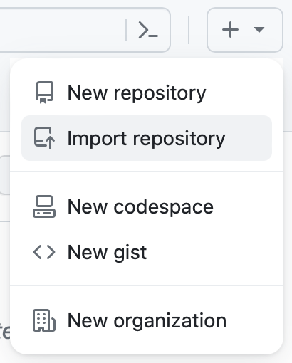

ULTERA Data Templates Repository: [github.com/PhasesResearchLab/ULTERA-contribute](https://github.com/PhasesResearchLab/ULTERA-contribute)

## This Dataset

- _Your name, affiliation, and contact_
- _Brief description_
- _Anything else you like to say_

## ULTERA Database
This template repository was developed for contributing to the [**ULTERA Database**](https://ultera.org) carried under the 
[**DOE ARPA-E ULTIMATE program**](https://arpa-e.energy.gov/?q=arpa-e-programs/ultimate) that
aims to develop a new generation of materials for turbine blades in gas turbines and related
applications. 

The main scope of this dataset is collecting data on compositionally complex alloys (CCAs), also known as high entropy alloys (HEAs) and multi-principle-element alloys (MPEAs), with extra attention given to (1) high-temperature (refractory) mechanical data, (2) phases present under different processing conditions. Although low-entropy alloys (incl. binaries) are typically not presented to the end-user (or counted in statistics), some are present and used in ML efforts; thus **all high-quality alloy data contributions are welcome!**

## How to Contribute?
You pretty much only need to restructure your data into a spreadsheet. **Publishing should take less than brewing a coffee.** Simply:

1. Fork this repository (button in the top-right corner). Please add a unique identifier (not belonging to any other fork) to the fork's name, i.e., ULTERA-contribute`-yourNameHere`, such as, e.g.:
   
    `-AlloyDataAMK`, `-amkrajewski`, `-10.20517-jmi.2021.05`, or `-jmi2021adetal`.
   
   Please note that on a personal GitHub account, you can only have a single fork of a repository; thus, if you want to upload data from multiple sources, it is advisable to follow one of the first two examples above. Then, you can keep each source in a separate spreadsheet.
   
3. See how the sample template is filled. The fields have short descriptions and examples above them. The `templateSampleFilled_v4.xlsx` contains some filled examples.

4. Remove the `templateSampleFilled_v4.xlsx` sample file (just to keep things neat) and rename `template_v4.xlsx` to something describing what you are uploading and that will help you remember what is inside, e.g., `refractory_bcc_heas`, `CrMoNiBased_DuctilityAndHardness`, `HardnessCollectionHEA` or, for single-publication data, the DOI `10.20517-jmi.2021.05`.

   _Avoid_ putting the version number or year in the name, as it will make correcting errors in the datasets much more difficult.

7. Fill out the spreadsheet with your data. Do not hesitate to [open an issue in this (source) repository](https://github.com/PhasesResearchLab/ULTERA-contribute/issues) in case you have any questions!

8. (optional/recommended) Enable the `Issues` page for your fork by (1) going to `Settings`, (2) scrolling down to `Features`, and (3) checking the box next to Issues. This will allow others to let you know if they find any problems with your data, or just want to ask questions.
   
9. Let us know your data is ready! We will clone your forked repository as a submodule and automatically process the data into the ULTERA through [the pushing meta-repository (github.com/PhasesResearchLab/ULTERA-push)](https://github.com/PhasesResearchLab/ULTERA-push)

## Fancy Stuff Through Actions

### (before you start) Enabling GitHub Actions

All of the functionalities below rely on automated "actions" that happen at predetermined events (e.g. Excel2CSV converter will run every time you push a modification to your dataset; either a single commit of a set of them) and **should just work out-of-the box if enabled (easy 30s job)**. You will just wait to see the results in a minute or so or track progress under `Actions` tab in the top GitHub menu.

To enable them, you will only need to:
1. Go to: Settings > Actions (General) > Actions permissions
2. Select "Allow all Actions and Reusable Workflows"
3. Save and refresh the page
4. Scroll down to "Workflow permissions" and select "Read and write permissions"
5. Save and refresh the page

Now, you should be good to go! You can verify everything work by going to the aforementioned `Actions` tab in the top GitHub menu.

### Tracking changes in data while retaining Excel style and functions

When publishing a dataset, one usually has to make a choice between storing it in either (a) plaintext formats, like TXT, CSV, and JSON, or (b) in one of the rich data formats, like Excel/Word Spreadsheet or table in PDF of a paper. 

The first option, **plaintext**, is typically preferred by scientists focused on the data as a training input for modeling efforts (whether covering simple statistics or fancy machine learning models) since it is usually (1) easier to digest by computer programs, (2) doesn't introduce any ambiguities on what is stored in it (all data is plain without, e.g., rounded numbers), (3) every change to the dataset can be tracked by git (either locally or through services like GitHub or GitLab) so that researcher know exact changes between data right now versus let's say 7 months earlier, and perhaps most significantly (4) can reference and compare datasets by commits thus allowing precise statements like _"V13 of the model used additional 5 yield stress data points and 17 hardness data points for alloys #3,27,79 while skipping 2 outliers (#111,112) we identified in May as coming from contaminated experiments"._

The **rich format** options like Excel spreadsheets are typically preferred by scientists, as they provide a number of conveniences. They (1) allow styling of the dataset, ranging from, e.g., customizable spreadsheet table column widths to make display much clearer to view, through the possibility of setting small fonts when describing data fields, to the automated highlighting of values that are outside of an accepted range. They also (2) allow one to have one column with data in original units and automatically convert them as needed to different ones on the fly, (3) format the displayed precision to the liking of the researcher or community while retaining full precision, and even (4) store images inside them for reference. However, the rich formats are usually binary and thus cannot be tracked by git (see plaintext advantages) beyond versioning them and commenting changes. This works for small modifications but quickly gets out of hand as the dataset matures and tens or hundreds of changes are made. 

**In this contribution repository, we enable both at the same time.** The template you populate with your data is in the Excel Spreadsheet format and can be modified in any way that doesn't change its core structure. You can style it to your liking or even store some images outside of template fields. At the same time, every time you _push_ changes to the repository, an automated [GitHub action]((before-you-start)-Enabling-GitHub-Actions) defined in `excel2csv.yml` will convert all of your templates stored in the main directory of this repository into plain-text CSV files, add them to your git working branch, and, if there are any changes in your data, it will commit them under name `(automatic) excel2csv Action for Data Tracking`. Now, you will be able to both (1) see what has changed at the template modification time and (2) compare between these commits to see how your data was modified long-term.

## I want to contribute in the future, but I'm not ready to make it public yet

Forking a repository is an elegant one-click solution to clone the templates, make your contributions discoverable, and keep everything up-to-date. One caveat is that GitHub will not allow you to change the visibility of the repository - it will have to be public. It has a number of advantages, like enabling the community to review your data and efficiently communicate issues by simply opening them on the fork; however, we know that some people may want to keep their data private until they are ready to publish it.

To create a contribution to ULTERA (or any other dataset following the template schema) you will need to _import_ the repository. You can do so by going to the `Create new...` in the top-right corner of GitHub page and selecting `Import Repository`. 

Once the page opens, paste the URL of the original repository:

      https://github.com/PhasesResearchLab/ULTERA-contribute

Then select your repository name. Please follow the `ULTERA-contribute-*******` pattern and try to make the name informative. Lastly, select the visibility you would like to have. Go forward, wait a minute, and refresh the page; you should now see your data repository!

Now, since it's not a fork, things get a bit more complex since you can't just click a button and synchronize your fork, resolving all the issues on the fly in GitHub. However, _if the modifications you make do not introduce any conflicts_ (keep up-to-date with template when introducing changes), you should be able to just add the public template repository as one of the remotes:

      git remote add public https://github.com/PhasesResearchLab/ULTERA-contribute

and then, whenever you want to make your repository up-to-date, simply pull changes from ULTERA-contribute

      git pull public main
   
and push it to yours:

      git push origin main

With that, you should be ready to store all of your data and make it public when you are ready. Then just let us know, so we can add it to [the pushing meta-repository (github.com/PhasesResearchLab/ULTERA-push)](https://github.com/PhasesResearchLab/ULTERA-push)

